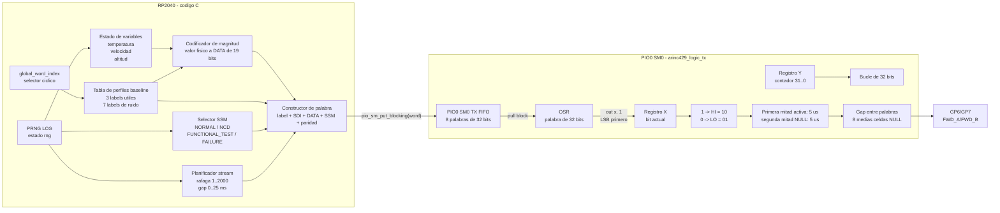
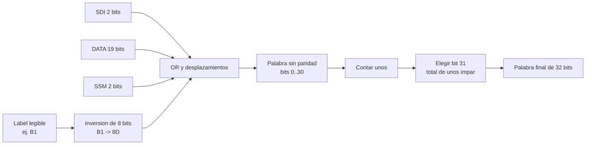
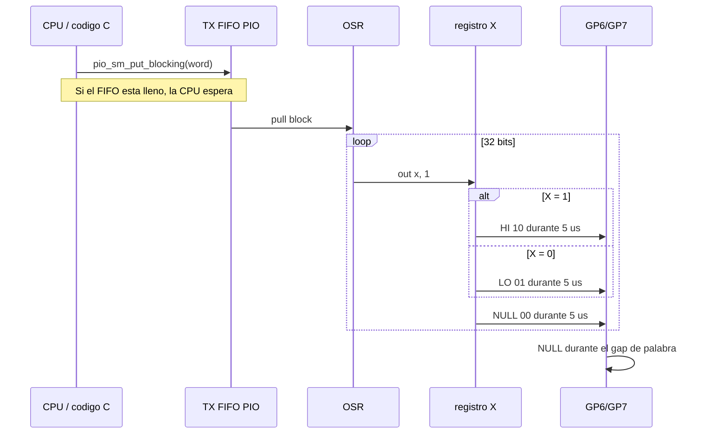
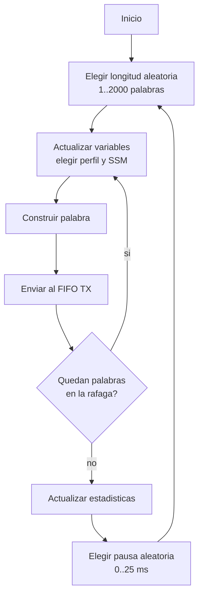

# Diagrama interno: ARINC-TX

## 1. Funcion de la placa

ARINC-TX genera palabras ARINC de laboratorio, las codifica como una senal
bipolar con retorno a cero y las transmite por:

- `GP6`: FWD_A.
- `GP7`: FWD_B.

En el modo operativo validado, `arinc_tx_arinc429_logic_stream_gp6_gp7`, transmite
rafagas aleatorias de 1 a 2000 palabras con pausas aleatorias de 0 a 25 ms a
`100 kbps`. El target `arinc_tx_arinc429_logic_stream_12k5_gp6_gp7` fuerza
`12.5 kbps`. No espera ACK y no depende del canal REV.

## 2. Diagrama general

## 3. Construccion de la palabra

La palabra se arma en un `uint32_t`. La numeracion siguiente es la posicion
interna usada por el firmware:

| Bits en `uint32_t` | Longitud | Campo | Operacion |
|---|---:|---|---|
| 0..7 | 8 | Label en orden de cable | `reverse_u8(label)` |
| 8..9 | 2 | SDI | `sdi & 0x03` |
| 10..28 | 19 | DATA | `data & 0x7FFFF` |
| 29..30 | 2 | SSM | `ssm & 0x03` |
| 31 | 1 | Paridad impar | Calculada sobre bits 0..30 |

El label se invierte antes de colocarlo en el byte bajo porque el PIO extrae
la palabra LSB primero. Al recibirla, el firmware vuelve a invertir ese byte
para recuperar el label legible.

Ejemplos:

| Label logico | Byte transmitido primero |
|---|---|
| `0xA5` | `0xA5` |
| `0xB1` | `0x8D` |
| `0xC2` | `0x43` |

## 4. Generacion de magnitudes

| Label | SDI | Nombre | Codificacion TX |
|---|---:|---|---|
| `0xA5` | 0 | TEMPERATURA | `raw = (temperatura_C + 50) / 0.25` |
| `0xB1` | 1 | VELOCIDAD | `raw = velocidad_kt` |
| `0xC2` | 2 | ALTITUD | `raw = altitud_ft / 10` |

Los demas perfiles generan trafico de ruido para demostrar que el receptor y
el sniffer no aceptan cualquier palabra solo porque su paridad sea correcta.

## 5. Movimiento por registros y FIFO PIO

Detalles:

- La union `PIO_FIFO_JOIN_TX` entrega a SM0 un FIFO TX de 8 palabras.
- `pull block` evita que el PIO transmita datos inexistentes.
- `OSR` conserva la palabra y la desplaza bit por bit.
- `X` contiene solamente el bit que se esta transmitiendo.
- `Y` comienza en 31 y controla las 32 iteraciones.
- El divisor PIO se calcula con la velocidad activa del target.
- A `100 kbps`, cada bit ocupa 10 us: 5 us activo y 5 us en NULL.
- A `12.5 kbps`, cada bit ocupa 80 us: 40 us activo y 40 us en NULL.
- El PIO mantiene la temporizacion aunque la CPU este preparando la palabra
  siguiente.

## 6. Simbolos electricos logicos

El valor escrito por `set pins` se interpreta como `GP7:GP6`:

| Bit | Valor PIO | GP6 | GP7 | Simbolo | `GP7 - GP6` ideal |
|---:|---:|---:|---:|---|---:|
| 1 | `10` | 0 | 1 | HI | +3.3 V |
| 0 | `01` | 1 | 0 | LO | -3.3 V |
| reposo | `00` | 0 | 0 | NULL | 0 V |
| invalido | `11` | 1 | 1 | INVALID | 0 V, no generado |

Si el osciloscopio calcula `GP6 - GP7`, los signos positivo y negativo quedan
invertidos. La codificacion no cambia; cambia el orden de la resta.

Estos son niveles logicos de laboratorio. Una interfaz ARINC 429 de campo
requiere un line driver que produzca los niveles y la impedancia definidos por
la norma; no se conecta el RP2040 directamente a una linea aeronautica real.

## 7. Modo stream actual

Este modo demuestra que el enlace no depende de lotes fijos de 1000 palabras.
Las rafagas son ventanas de generacion, no unidades de protocolo ni bloques que
el receptor deba completar.

## 8. Modo batch historico

El target de laboratorio conserva el mecanismo anterior:

1. Limpia el receptor REV de TX.
2. Transmite 1000 palabras por FWD.
3. Espera una palabra `0xAC/SDI 3` por GP4/GP5.
4. Comprueba paridad, SSM y numero de lote.
5. Inicia el lote siguiente.

Este modo sirve para ensayos de ida y vuelta, pero no representa un unico bus
ARINC bidireccional. FWD y REV son dos enlaces simplex independientes.

## 9. Recursos internos principales

| Recurso | Uso |
|---|---|
| CPU RP2040 | Generacion de datos, labels, SSM, paridad y estadisticas |
| PIO0 SM0 | Transmisor FWD bipolar RZ |
| PIO0 SM1 | Receptor REV en targets que lo habilitan |
| TX FIFO SM0 | Desacopla la CPU de la temporizacion de cada bit |
| OSR | Registro de desplazamiento de la palabra transmitida |
| X | Bit actual |
| Y | Contador de 32 bits |

## 10. Fuentes de implementacion

- [`ARINC-TX/arinc_tx.c`](../../ARINC-TX/arinc_tx.c)
- [`ARINC-TX/arinc429_logic.h`](../../ARINC-TX/arinc429_logic.h)
- [`ARINC-TX/arinc429_logic.pio`](../../ARINC-TX/arinc429_logic.pio)
