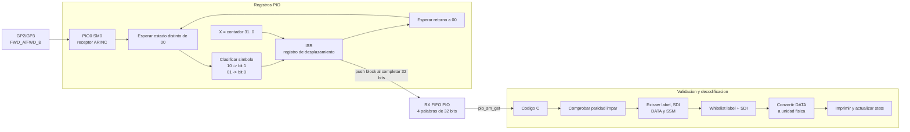
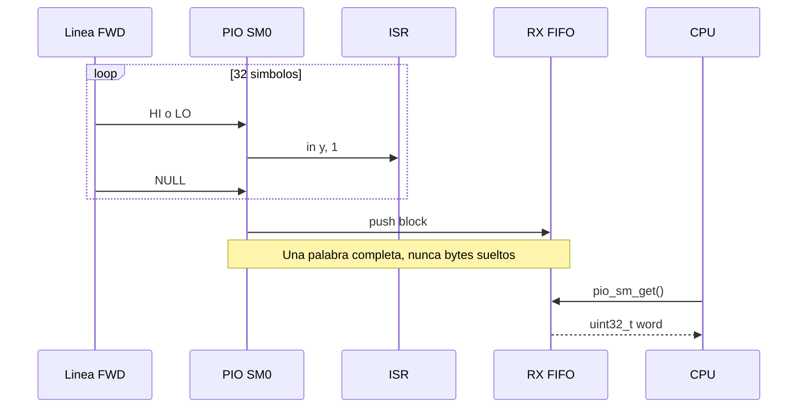
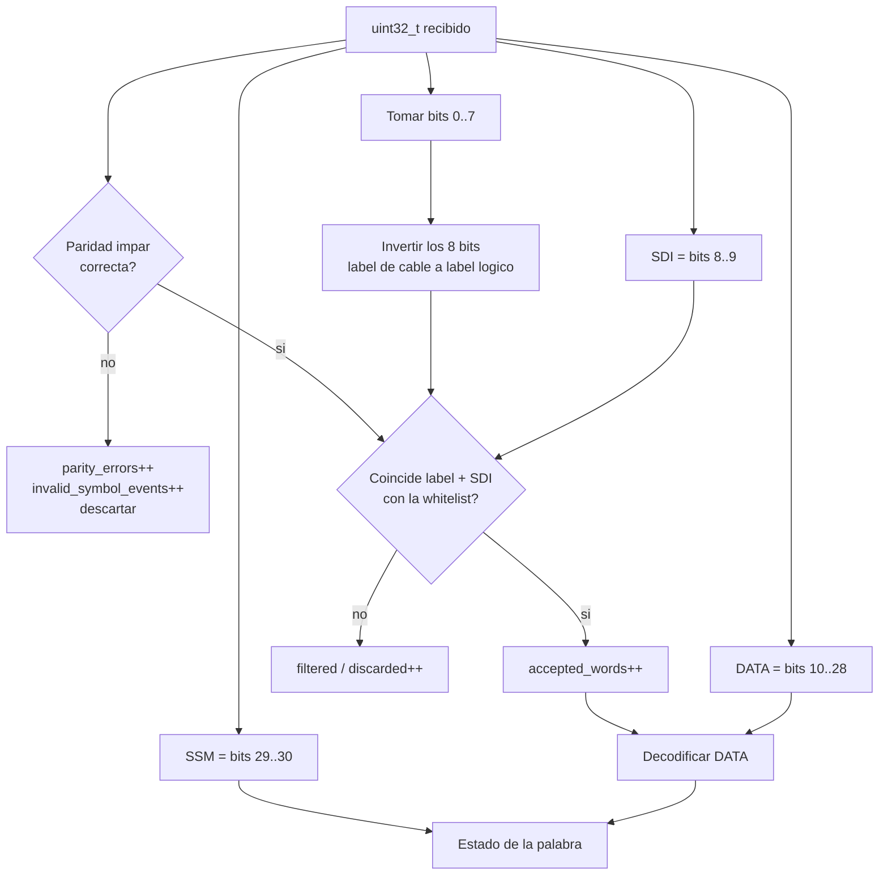
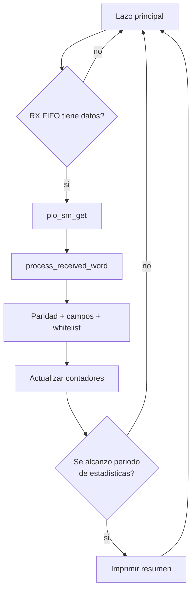
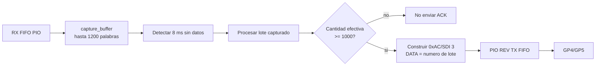

# Diagrama interno: ARINC-RX

## 1. Funcion de la placa

ARINC-RX recibe el canal FWD por:

- `GP2`: FWD_A.
- `GP3`: FWD_B.

En el modo operativo actual, `arinc_rx_arinc429_logic_stream`, procesa cada
palabra apenas aparece en el FIFO. No acumula un lote fijo y no transmite ACK.

## 2. Diagrama general

## 3. Reconstruccion de un bit

El PIO observa los dos GPIO como un simbolo de dos bits. En la columna se usa
el orden `GP3:GP2`, igual al valor numerico escrito por el PIO TX:

| `GP3:GP2` | Significado | Bit reconstruido |
|---|---|---:|
| `10` | HI | 1 |
| `01` | LO | 0 |
| `00` | NULL | ninguno, espera |
| `11` | Estado no valido | no tiene rechazo explicito en el PIO actual |

Para cada bit:

1. Espera actividad distinta de `00`.
2. Usa el segundo pin como condicion de salto para distinguir HI de LO.
3. Inserta un `1` o un `0` en el ISR.
4. Espera que ambos pines regresen a NULL.
5. Decrementa el contador.
6. Despues de 32 bits hace `push block`.

El estado `11` no se clasifica de forma separada dentro del programa PIO. Una
alteracion de esa clase normalmente termina manifestandose despues como una
palabra con paridad, label o contenido no plausible. Un receptor de campo
deberia detectar tambien la validez electrica y temporal del simbolo.

## 4. Movimiento por ISR y FIFO

El RX FIFO conserva hasta 4 palabras porque este SM no usa `FIFO_JOIN_RX`.
Absorbe diferencias cortas entre el ritmo de llegada y el tiempo de servicio
de la CPU. En stream, la CPU lo drena continuamente. Si la CPU
dejara de atenderlo durante demasiadas palabras, el FIFO podria desbordarse;
por eso el camino normal evita operaciones largas dentro del lazo de captura.

## 5. Interpretacion de la palabra

La implementacion endurecida exige paridad correcta antes de aplicar la
whitelist. Una palabra con mala paridad se contabiliza en `received_words` y
`parity_errors`, pero no incrementa `accepted_words` ni se decodifica como una
medicion valida.

## 6. Whitelist y escalado

| Label / SDI | Nombre | Formula RX |
|---|---|---|
| `0xA5 / 0` | TEMPERATURA | `temperatura_C = raw * 0.25 - 50` |
| `0xB1 / 1` | VELOCIDAD | `velocidad_kt = raw` |
| `0xC2 / 2` | ALTITUD | `altitud_ft = raw * 10` |

El label no es suficiente por si solo. La pareja `(label, SDI)` identifica el
tipo de dato aceptado. Esto evita aceptar una palabra con el mismo label pero
destino o fuente logica diferente.

## 7. SSM

Los bits 29 y 30 se conservan y se presentan como estado:

| Valor | Texto usado |
|---:|---|
| 0 | FAILURE |
| 1 | NCD |
| 2 | FUNCTIONAL_TEST |
| 3 | NORMAL |

El firmware no modifica la magnitud en funcion del SSM: informa ambos datos
para que la capa de visualizacion pueda mostrar el valor y su condicion.

## 8. Modo stream actual

No existe una cola de 1000 palabras en este modo. Cada palabra completa pasa
directamente del FIFO PIO al decodificador C. La longitud o separacion de las
rafagas del TX no cambia el algoritmo.

## 9. Modo batch historico con ACK

El target de laboratorio conserva una cola en RAM de 1200 palabras:

Este bloque no participa en la prueba de stream vigente. Se mantiene como
instrumento de laboratorio para demostrar dos enlaces simplex coordinados.

## 10. Recursos internos principales

| Recurso | Uso |
|---|---|
| PIO0 SM0 | Muestreo y reconstruccion FWD |
| ISR | Registro de desplazamiento de los 32 bits recibidos |
| X | Contador de bits |
| Y | Bit temporal 0/1 y lectura de pines |
| RX FIFO SM0 | Entrega palabras completas a la CPU |
| CPU RP2040 | Paridad, extraccion, filtro, escalado y estadisticas |
| Buffer RAM 1200 | Solo modo batch historico |
| PIO REV TX | Solo targets con ACK habilitado |

## 11. Limite del bloque actual

La placa recibe niveles GPIO de 0 a 3.3 V. Para conectarse a ARINC 429 real
debe precederse por un receptor diferencial ARINC que:

- soporte los niveles bipolares de campo;
- presente alta impedancia a la linea;
- proteja contra transitorios;
- entregue una salida logica segura al RP2040;
- detecte umbrales y estados invalidos segun la interfaz elegida.

## 12. Fuentes de implementacion

- [`ARINC-RX/arinc_rx.c`](../../ARINC-RX/arinc_rx.c)
- [`ARINC-RX/arinc429_logic.h`](../../ARINC-RX/arinc429_logic.h)
- [`ARINC-RX/arinc429_logic.pio`](../../ARINC-RX/arinc429_logic.pio)
