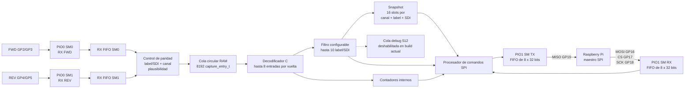
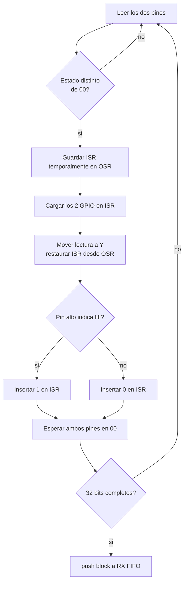
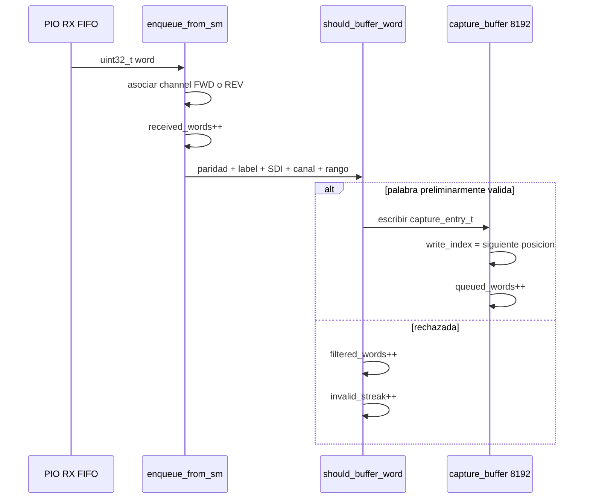
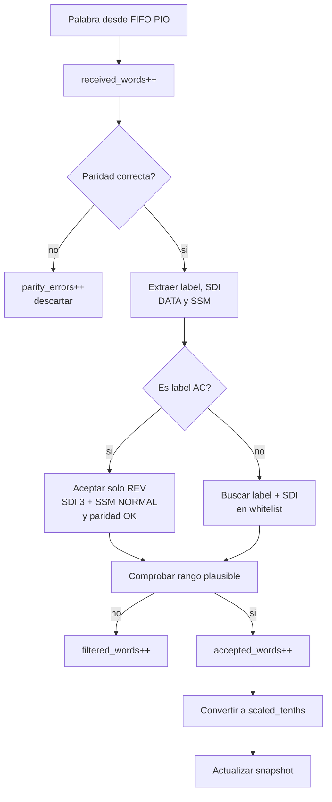
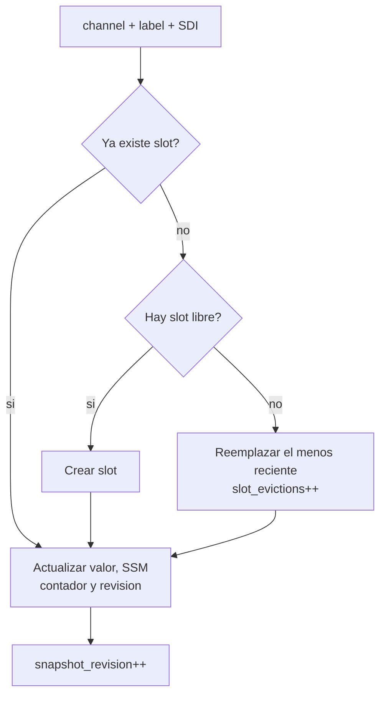
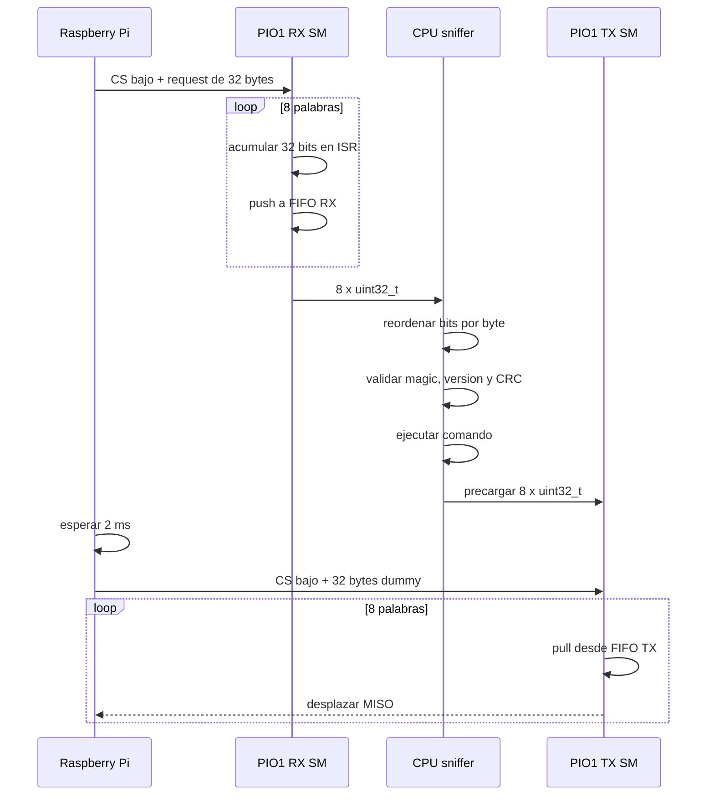
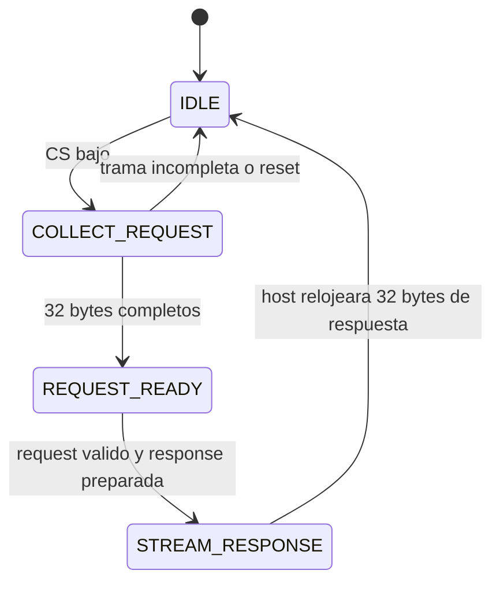

# Diagrama interno: ARINC-SNIFFER

## 1. Funcion de la placa

ARINC-SNIFFER escucha de forma pasiva dos enlaces:

- FWD: `GP2/GP3`.
- REV: `GP4/GP5`.

No transmite por ninguno de ellos. Sus unicas salidas son la respuesta SPI
hacia la Raspberry Pi y la senal diagnostica opcional `DRDY` en GP20.

## 2. Diagrama general



## 3. Captura ARINC en PIO0

Cada state machine ejecuta el receptor bipolar RZ:



Registros usados:

| Registro | Funcion |
|---|---|
| ISR | Acumula los 32 bits de la palabra |
| OSR | Preserva temporalmente el ISR mientras se leen dos pines |
| X | Contador de bits |
| Y | Estado de pines o bit reconstruido |
| RX FIFO | Frontera entre PIO y codigo C |

Las state machines FWD y REV son independientes. Una rafaga REV no detiene la
captura FWD y viceversa.

## 4. Del FIFO PIO a la cola circular

La CPU llama a `enqueue_from_sm` para drenar ambos FIFO:



Cada entrada de la cola contiene:

```c
typedef struct {
    uint32_t word;
    uint8_t channel;
} capture_entry_t;
```

Comportamiento de la cola:

- Capacidad: 8192 palabras.
- `write_index`: siguiente posicion de escritura.
- `read_index`: siguiente posicion de lectura.
- `queued_words`: ocupacion actual.
- Si se llena, descarta la entrada nueva e incrementa `overflow_events`.
- En cada vuelta del lazo principal se procesan hasta 8 entradas.

## 5. Resincronizacion

El sniffer vigila dos sintomas:

1. Una racha de 32 palabras no plausibles.
2. En FWD, 500 ms sin recibir una palabra cruda y con la cola vacia.

Ante esas condiciones reinicia la state machine PIO del canal afectado y
actualiza `fwd_resync_events` o `rev_resync_events`. La resincronizacion no
borra las estadisticas generales ni obliga a reiniciar la placa.

En FWD tambien clasifica:

- `fwd_startup_resync_events`: antes de la primera palabra FWD aceptada;
- `fwd_operational_resync_events`: despues de que el enlace FWD ya quedo
  armado.

## 6. Filtro y decodificacion



La paridad se valida antes de ingresar a la cola circular de captura. Tanto en
FWD como en REV, una palabra incorrecta queda visible en los contadores de
recepcion y paridad, pero no llega al snapshot ni a `accepted_words`.

Filtro por defecto:

| Entrada | Canal esperado | Nombre |
|---|---|---|
| `0xA5 / 0` | FWD | TEMPERATURA |
| `0xB1 / 1` | FWD | VELOCIDAD |
| `0xC2 / 2` | FWD | ALTITUD |
| `0xAC / 3` | REV | ACK_BATCH historico |

El filtro SPI admite hasta 10 entradas. Puede configurarse en modo whitelist o
en modo pass-all.

Rangos de plausibilidad actuales:

| Dato | Rango |
|---|---|
| Temperatura | -50 a 100 C |
| Velocidad | 0 a 400 kt |
| Altitud | 0 a 15000 ft |
| ACK | 0 a 100000 |

## 7. Snapshot de ultimos valores

El bridge no necesita extraer millones de eventos individuales. El sniffer
mantiene hasta 16 slots, identificados por:

```text
(channel, label, SDI)
```

Cada slot contiene:

| Campo | Significado |
|---|---|
| `valid` | Slot inicializado |
| `channel` | FWD o REV |
| `label`, `sdi`, `ssm` | Campos ARINC decodificados |
| `raw` | DATA sin escalar |
| `scaled_tenths` | Magnitud en decimas |
| `parity_ok` | Resultado de paridad |
| `update_counter` | Revision de la ultima actualizacion |
| `hit_count` | Cantidad total de palabras de esa clave |



Esto conserva el ultimo estado y el conteo acumulado de cada parametro sin
mantener una copia RAM de cada palabra aceptada.

## 8. Paquete SPI

Cada request y cada response ocupa exactamente 32 bytes:

| Bytes | Campo |
|---|---|
| 0..1 | Magic `A4 29` |
| 2 | Version |
| 3 | Comando o tipo de respuesta |
| 4 | Status |
| 5 | Flags |
| 6..7 | Sequence little-endian |
| 8..29 | Payload de 22 bytes |
| 30..31 | CRC16 |

Comandos implementados:

| Comando | Funcion |
|---|---|
| `PING` | Verificar enlace y protocolo |
| `POP_EVENT` | Extraer evento de la cola debug |
| `GET_STATS` | Leer contadores |
| `GET_FILTER` | Leer filtro |
| `SET_FILTER` | Reconfigurar filtro |
| `RESET_STATS` | Reiniciar contadores seleccionados |
| `GET_LATEST_META` | Leer revision y cantidad de slots |
| `GET_LATEST_SLOT` | Leer un slot por indice |

## 9. SPI slave PIO-frame

La implementacion vigente usa PIO1 y mueve una trama completa por transaccion,
no una llamada SPI por byte.



Registros del PIO SPI:

| Camino | Registro/FIFO | Funcion |
|---|---|---|
| MOSI -> sniffer | ISR RX | Acumula bits recibidos |
| MOSI -> sniffer | FIFO RX unido | 8 palabras, una trama completa |
| sniffer -> MISO | FIFO TX unido | 8 palabras precargadas |
| sniffer -> MISO | OSR TX | Desplaza una palabra hacia GP19 |
| ambos | X | Cuenta 32 bits |
| ambos | Y | Cuenta 8 palabras |

La CPU invierte los bits dentro de cada byte al empacar y desempaquetar porque
el orden natural del desplazamiento PIO y el orden SPI de los bytes difieren.

## 10. Fases internas del enlace SPI



El request y la response son dos transacciones separadas. Esto da tiempo a la
CPU del RP2040 para validar el paquete, consultar el snapshot y cargar el FIFO
TX antes de que el maestro genere los clocks de respuesta.

## 11. DRDY

En la build `SPI-PIOFRAME-ARINC429-STRICTPARITY-DRDY-V3`, `GP20` se usa como
`DRDY` puro:

- sube cuando el snapshot recibe una palabra aceptada nueva;
- baja cuando la 3B+ atiende `GET_LATEST_META`;
- se conecta a `GPIO25` en la Raspberry Pi.

El host puede seguir usando polling como fallback. La mejora reduce consultas
inutiles: la 3B+ solo pide snapshot cuando el sniffer avisa que hay estado
nuevo, o cuando vence el timeout de respaldo.

## 12. Capacidades y cuellos de botella

| Etapa | Capacidad / ritmo |
|---|---|
| ARINC FWD | 100 kbps |
| RX FIFO PIO por canal | 4 palabras completas, absorcion corta |
| Cola de captura | 8192 palabras |
| Procesamiento CPU | Hasta 8 entradas por vuelta |
| Filtro configurable | 10 entradas |
| Snapshot | 16 claves |
| Cola debug | 512 eventos, deshabilitada |
| SPI operacional | PIO-frame a 8 MHz |
| Paquete SPI | 32 bytes request + 32 bytes response |

El cuello practico ya no es la tasa de bits del ARINC. El snapshot reduce el
volumen exportado: la Raspberry consulta estado y contadores, no intenta copiar
cada una de las palabras recibidas. La prueba de 9 horas a 8 MHz termino con
`spi_errors=0`, sin drops ni overflow.

## 13. Limite para uso en campo

GP2..GP5 reciben niveles logicos de laboratorio. El sniffer plug-and-play final
necesita delante de cada par:

- proteccion y limitacion de transitorios;
- receptor diferencial ARINC 429;
- alta impedancia para no cargar el bus;
- aislamiento si el requisito del producto lo exige;
- conectores, blindaje y referencia de masa definidos;
- validacion de umbrales, ruido, common mode y fallas de cableado.

## 14. Fuentes de implementacion

- [`ARINC-SNIFFER/ARINC_SNIFFER.c`](../../ARINC-SNIFFER/ARINC_SNIFFER.c)
- [`ARINC-SNIFFER/arinc429_logic.pio`](../../ARINC-SNIFFER/arinc429_logic.pio)
- [`ARINC-SNIFFER/spi_frame_slave.pio`](../../ARINC-SNIFFER/spi_frame_slave.pio)
- [`ARINC-SNIFFER/sniffer_spi_protocol.h`](../../ARINC-SNIFFER/sniffer_spi_protocol.h)
