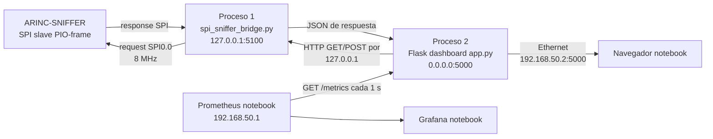
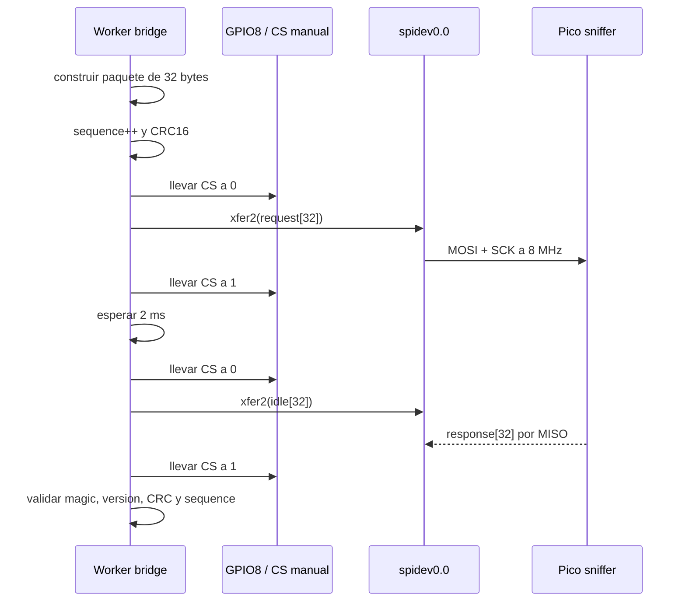
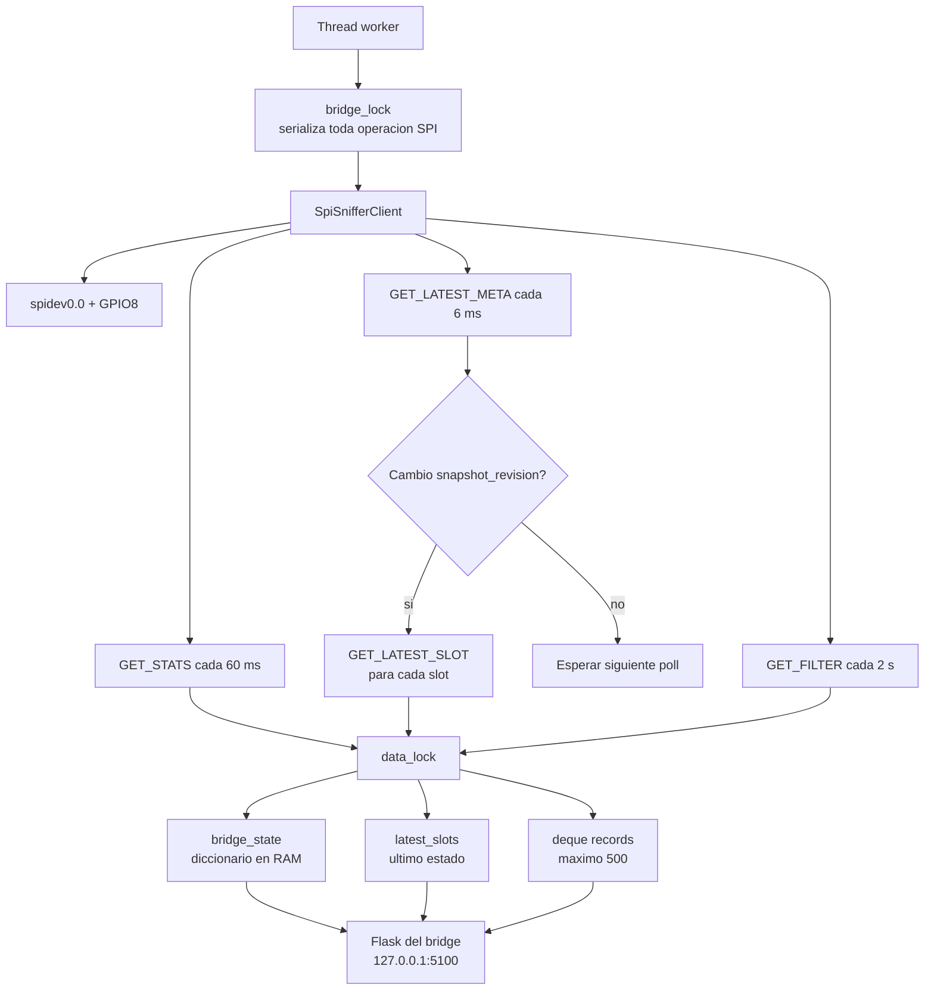
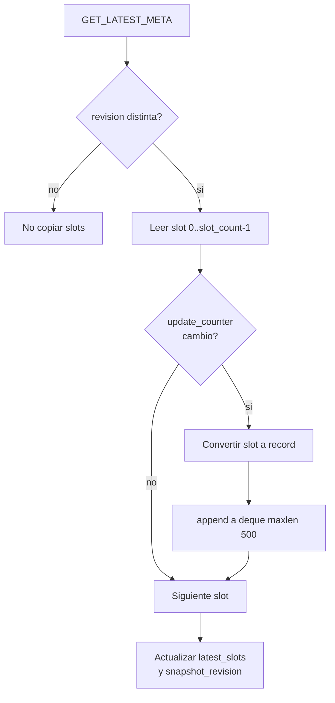
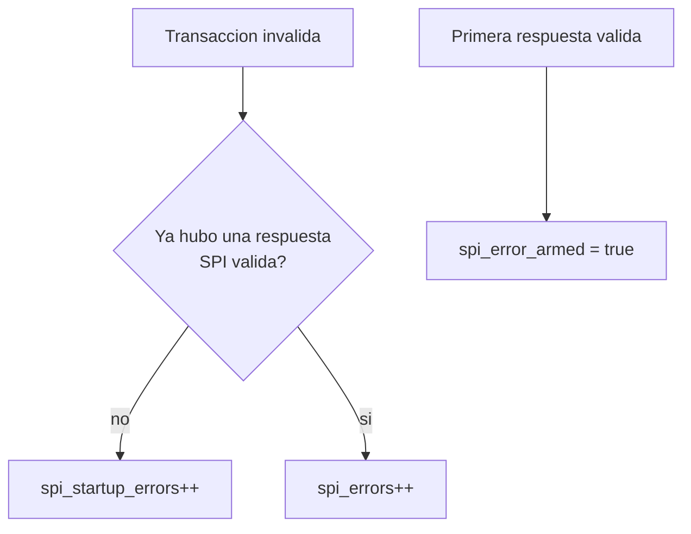
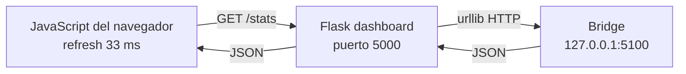
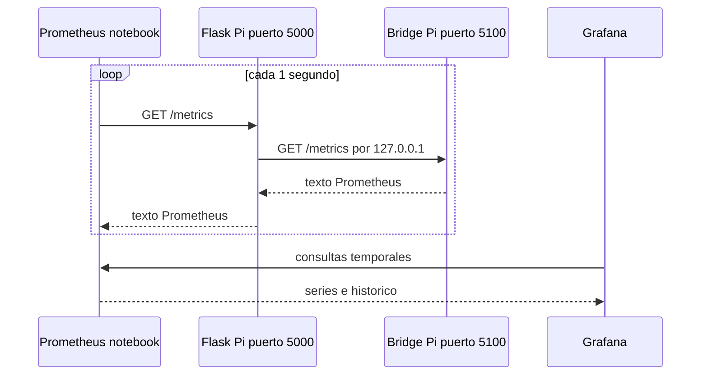
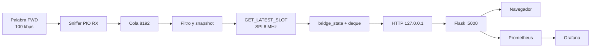
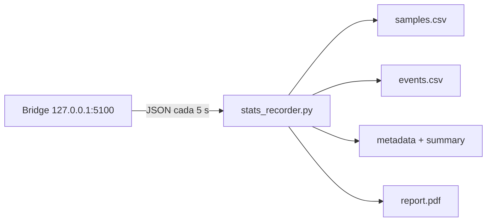

# Diagrama interno: Raspberry Pi 3B+ y visualizacion

## 1. Funcion de la placa

La Raspberry Pi 3B+ cumple cuatro funciones:

1. Actua como maestro SPI del ARINC-SNIFFER.
2. Mantiene una imagen en memoria de estadisticas, filtro y ultimos valores.
3. Expone esos datos por HTTP local mediante el bridge.
4. Sirve el dashboard Flask hacia la notebook por Ethernet.

La captura ARINC no ocurre en Flask. Ocurre en el RP2040 del sniffer.

## 2. Arquitectura de procesos y red

Direcciones recomendadas:

| Equipo | Interfaz | Direccion |
|---|---|---|
| Notebook | Ethernet | `192.168.50.1/24` |
| Raspberry Pi | `eth0` | `192.168.50.2/24` |
| Bridge | loopback | `127.0.0.1:5100` |
| Dashboard | todas las interfaces | `0.0.0.0:5000` |

El bridge no necesita una IP publica. Flask accede a el por `127.0.0.1`, que
recorre la pila TCP/IP local de Linux sin salir por Ethernet. No se usa un Unix
domain socket.

## 3. Camino SPI fisico

| Raspberry Pi | Sniffer | Funcion |
|---|---|---|
| MOSI | GP16 | Request hacia el sniffer |
| CE0 / GPIO8 | GP17 | Chip select manual |
| SCLK | GP18 | Reloj generado por la Pi |
| MISO | GP19 | Response hacia la Pi |
| GPIO25 | GP20 | DRDY, aviso de snapshot nuevo |
| GND | GND | Referencia comun |

Configuracion operativa validada:

| Parametro | Valor |
|---|---|
| Transfer mode | `pio-frame` |
| Frecuencia | 8 MHz |
| Request mode | `drdy` con fallback por timeout |
| CS | Manual por GPIO8 |
| Setup / hold CS | 100 us / 100 us |
| Delay entre request y response | 2 ms |
| Poll del bridge | 6 ms |
| Refresh de stats | 60 ms |

## 4. Una operacion SPI completa

El control manual de CS se realiza con `pinctrl` o `raspi-gpio`. El objetivo es
dar a la state machine del sniffer limites de trama inequivocos.

## 5. Bloques internos del bridge

### Locks

| Lock | Protege |
|---|---|
| `bridge_lock` | Evita dos transacciones SPI simultaneas |
| `data_lock` | Evita leer estado mientras otro thread lo actualiza |

Los endpoints de filtro y reset tambien toman `bridge_lock`, por lo que no
pueden intercalar sus bytes con el polling de fondo.

## 6. Actualizacion del snapshot en la Pi

`hit_count` contiene la cantidad acumulada por label. `update_counter` permite
detectar si el slot recibio una nueva palabra desde la consulta anterior,
aunque la magnitud se haya repetido. El bridge agrega un registro reciente
cuando detecta una revision nueva del slot.

No hay una FIFO HTTP. Existen:

- FIFO de hardware en el PIO del sniffer;
- cola circular de captura en el sniffer;
- `deque` de hasta 500 registros en la RAM de la Raspberry;
- diccionarios protegidos por mutex;
- sockets TCP administrados por Linux para las peticiones HTTP.

## 7. Endpoints del bridge

| Endpoint | Metodo | Funcion |
|---|---|---|
| `/health` | GET | Estado basico del bridge |
| `/stats` | GET | Estadisticas combinadas |
| `/records` | GET | Ventana de registros recientes |
| `/filter` | GET | Leer filtro |
| `/filter` | POST | Cambiar filtro del sniffer |
| `/control/reset` | POST | Reiniciar estadisticas |
| `/metrics` | GET | Metricas Prometheus |

`/stats` combina:

- contadores obtenidos con `GET_STATS`;
- `hit_count` de los slots;
- ultimos valores escalados;
- estado del bridge;
- errores SPI de arranque y operativos.

## 8. Clasificacion de errores SPI

Esta separacion evita presentar como errores operativos los intentos realizados
cuando el bridge ya esta activo pero el sniffer todavia esta apagado. En la
prueba validada de 9 horas a 8 MHz hubo:

- `spi_errors = 0`;
- `spi_startup_errors = 1`;
- `spi_drop_events = 0`;
- `overflow_events = 0`.

## 9. Dashboard Flask

El dashboard es otro proceso Python. En modo `bridge` no abre SPI ni duplica el
driver. Solo consulta y controla al bridge mediante HTTP local.

Esto permite:

- reiniciar Flask sin reiniciar el enlace SPI;
- mantener un unico propietario de `spidev0.0`;
- aislar la captura de la interfaz grafica;
- cambiar la visualizacion sin modificar firmware.

## 10. Prometheus y Grafana

Flask es la vista operativa inmediata. Prometheus conserva series temporales y
Grafana permite analizarlas a lo largo de horas o dias.

## 11. Frecuencias SPI

El barrido medido mostro:

| Frecuencia | Resultado |
|---:|---|
| 100 kHz a 8 MHz | Perfecto en el barrido |
| 9 MHz | Perfecto en prueba corta |
| 10 MHz | Parcial, 13/24 |
| 16 MHz | 0/24, cabecera desplazada un bit |
| 50 MHz | 0/24, respuestas en cero |

La capacidad teorica maxima del controlador SPI no garantiza que el sistema
completo funcione a esa frecuencia. Tambien intervienen:

- temporizacion de las state machines PIO;
- latencia para preparar la respuesta;
- control de CS;
- cableado y calidad de senal;
- tiempos de setup/hold;
- orden de bits y sincronizacion de la primera muestra.

Por eso 8 MHz es el punto operacional validado, no una limitacion derivada de
los 100 kbps del ARINC. Son enlaces independientes y cumplen tareas distintas.

## 12. Recorrido completo de una medicion

Cada frontera tiene una responsabilidad definida: PIO conserva temporizacion,
la CPU del sniffer valida, SPI transporta estado, el bridge centraliza acceso y
Flask presenta la informacion.

## 13. Registro de evidencia

`stats_recorder.py` es un tercer proceso opcional. Solo consulta `/stats` por
loopback y no accede a SPI:

Puede finalizar por duracion, cantidad de palabras, orden manual o desconexion
sostenida. Los archivos se guardan en `~/PAMPA/ARINC_RESULTS`.

## 14. Fuentes de implementacion

- [`HOST_3b+/spi_sniffer_bridge.py`](../../HOST_3b+/spi_sniffer_bridge.py)
- [`HOST_3b+/sniffer_spi_protocol.py`](../../HOST_3b+/sniffer_spi_protocol.py)
- [`HOST_3b+/stats_recorder.py`](../../HOST_3b+/stats_recorder.py)
- [`HOST_3b+/systemd/arinc-sniffer-bridge.service`](../../HOST_3b+/systemd/arinc-sniffer-bridge.service)
- [`DASHBOARD_WEB/arinc_dashboard/app.py`](../../DASHBOARD_WEB/arinc_dashboard/app.py)
- [`prometheus/prometheus.yml`](../../prometheus/prometheus.yml)
