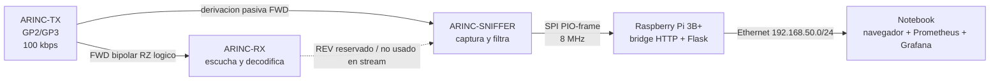

# Diagramas de bloques internos

Esta carpeta describe el recorrido interno de la informacion en cada placa del
sistema ARINC. Los diagramas representan la implementacion real del repositorio
en la rama `ARINC`, no una arquitectura generica.

## Diagramas

1. [ARINC-TX](01_arinc_tx.md)
   - Generacion de variables.
   - Construccion de la palabra de 32 bits.
   - Registros OSR/X/Y y FIFO TX de PIO.
   - Codificacion bipolar RZ.
   - Diferencia entre stream actual y batch historico con ACK.

2. [ARINC-RX](02_arinc_rx.md)
   - Deteccion HI/LO/NULL.
   - Reconstruccion en ISR y FIFO RX.
   - Extraccion de label, SDI, data, SSM y paridad.
   - Decodificacion fisica.
   - Diferencia entre stream actual y batch historico con ACK.

3. [ARINC-SNIFFER](03_arinc_sniffer.md)
   - Captura pasiva FWD y REV.
   - FIFO PIO, cola circular de captura y filtros.
   - Snapshot de 16 slots.
   - Protocolo SPI de tramas de 32 bytes.
   - Registros PIO del SPI slave y respuesta al host.

4. [Raspberry Pi 3B+ y visualizacion](04_raspberry_pi_3bplus.md)
   - Maestro SPI y CS manual.
   - Bridge HTTP local.
   - Memoria compartida y registros recientes.
   - Flask, navegador, Prometheus y Grafana.
   - Puertos, direcciones IP y frecuencias operativas.

## Arquitectura operativa vigente

La implementacion actual de stream no necesita que ARINC-RX responda. El
sniffer tampoco transmite sobre FWD o REV: sus cuatro GPIO ARINC son entradas.
