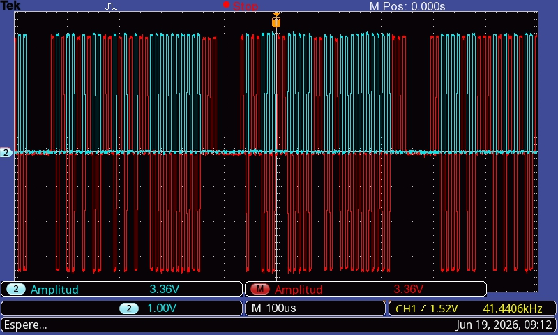
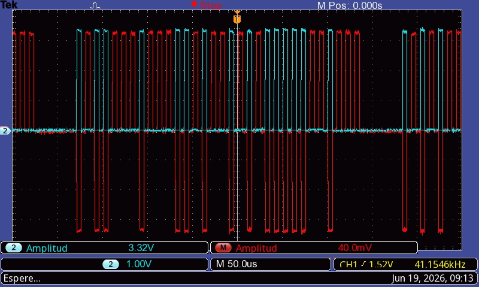
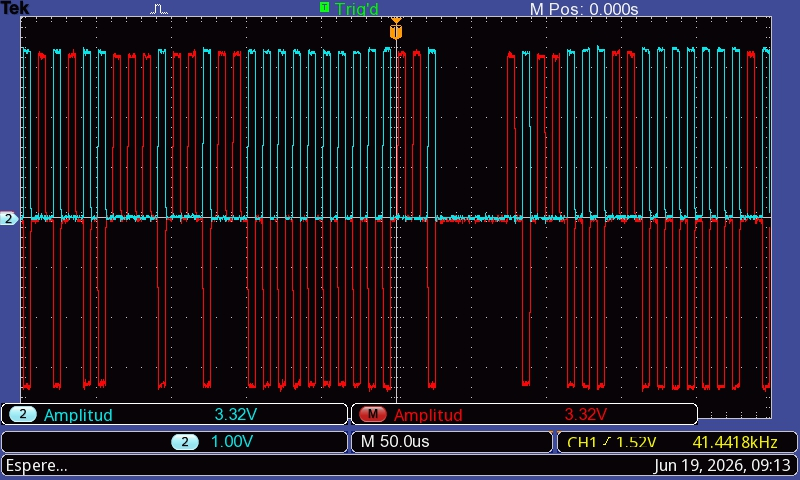
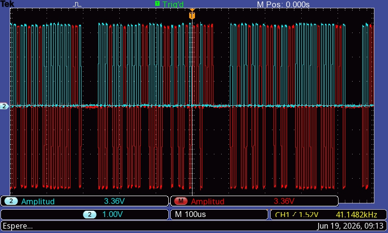
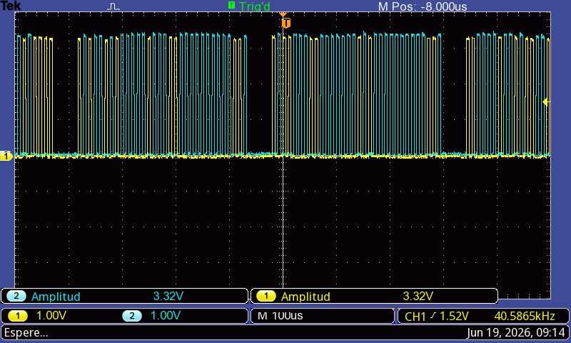
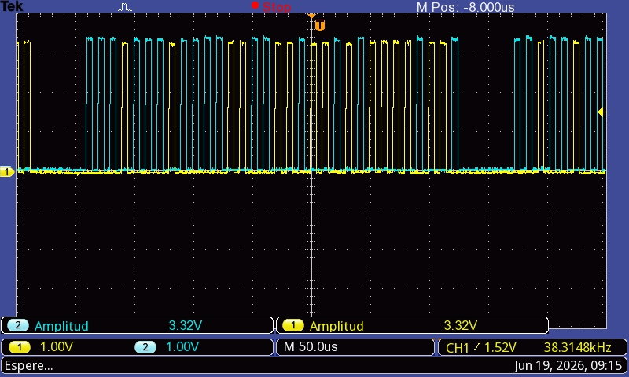

# Evidencia de osciloscopio ARINC logico - 2026-06-19

Esta evidencia resume las capturas tomadas durante la validacion temporal del
enlace ARINC 429 logico. Las mediciones corresponden a la fase de laboratorio:
los niveles son GPIO de 3,3 V y no niveles electricos ARINC 429 reales de
campo. El objetivo de estas capturas es verificar forma de onda, codificacion
bipolar con retorno a cero, longitud de palabra y separacion entre palabras.

## Lectura general

En modo MATH, el osciloscopio muestra la resta entre los canales. Esa resta es
la forma mas cercana a observar la senal ARINC como diferencial:

```text
Vdiff = CH1 - CH2
```

o, si el osciloscopio esta configurado al reves:

```text
Vdiff = CH2 - CH1
```

El signo puede invertirse segun la configuracion, pero la interpretacion es la
misma:

- pulso positivo: una polaridad logica;
- pulso negativo: la polaridad opuesta;
- cero: estado NULL o retorno a cero.

Cada bit ARINC se observa como una celda de 10 us:

```text
5 us activo + 5 us NULL = 10 us por bit = 100 kbps
```

La palabra completa ocupa:

```text
32 bits * 10 us = 320 us
```

Despues de cada palabra, el transmisor deja un gap minimo de 4 tiempos de bit:

```text
4 bits * 10 us = 40 us de NULL entre palabras
```

El modo stream tambien puede insertar pausas adicionales entre rafagas. Por eso
en algunas capturas aparecen espacios NULL mayores al gap minimo de 40 us.

## Capturas con MATH

Estas capturas muestran la senal diferencial logica reconstruida por el
osciloscopio. Se observan pulsos positivos y negativos de aproximadamente
3,3 V diferenciales, equivalentes logicos de los estados HI y LO de ARINC 429.



**TEK0007.** Vista amplia con MATH activo. Se observan varias palabras ARINC
consecutivas. Cada grupo de pulsos corresponde a una palabra de 32 bits; los
espacios horizontales corresponden a NULL entre palabras o pausa de stream.



**TEK0008.** Vista a 50 us/div. Permite observar mejor la estructura interna de
una palabra: pulsos de una u otra polaridad y retorno a cero entre simbolos.



**TEK0009.** Secuencia diferencial con polaridades alternadas. La zona sin
pulsos entre grupos es el estado NULL; el gap base implementado por firmware es
de 40 us.



**TEK0010.** Captura con tres grupos principales de palabra. La medicion visual
coincide con palabras de 32 bits a 100 kbps y con separacion por NULL.

## Capturas sin MATH

Estas capturas muestran los dos canales individuales contra masa. No deben
interpretarse como dos datos independientes: ambos forman el mismo par
diferencial. En un bit activo, una linea sube y la otra queda baja. En el bit de
polaridad opuesta, se invierte. En NULL ambas vuelven a cero.



**TEK0011.** CH1 y CH2 muestran las dos mitades del par logico. Las senales no
se pisan: cuando una linea esta activa, la otra queda en cero.


**TEK0012.** Vista a 50 us/div. Se observa el mismo patron con amplitud
individual cercana a 3,32 V por canal.



**TEK0013.** Captura complementaria de canales individuales. Es util para
explicar que el dato ARINC no esta en un solo cable, sino en la diferencia entre
ambos.

## Reconstruccion de una palabra

Desde una imagen JPG no es riguroso afirmar una palabra exacta, porque no se
dispone de muestras crudas ni cursores colocados bit a bit. Lo correcto para
reconstruir una palabra es:

1. Elegir el inicio de palabra.
2. Tomar una muestra en la primera mitad de cada celda de 10 us.
3. Asignar un valor binario a cada polaridad.
4. Repetir hasta obtener 32 bits.
5. Separar campos ARINC:

```text
bits 1..8    label
bits 9..10   SDI
bits 11..29  data
bits 30..31  SSM
bit 32       paridad impar
```

En este proyecto, el transmisor stream emite tres labels utiles y siete labels
de ruido por ciclo:

```text
0xA5/SDI0  TEMPERATURA
0xB1/SDI1  VELOCIDAD
0xC2/SDI2  ALTITUD
0x11, 0x24, 0x39, 0x4E, 0x57, 0x6A, 0x7D  ruido filtrable
```

Por lo tanto, una reconstruccion exacta desde CSV o cursores deberia caer en
alguno de esos labels, o ser descartada por el filtro si corresponde a ruido.

## Conclusiones

- La forma de onda reproduce la codificacion bipolar con retorno a cero de
  ARINC 429, pero en niveles logicos de 3,3 V.
- La duracion de bit queda validada en 10 us, equivalente a 100 kbps.
- La palabra ARINC se observa como un grupo de 32 bits.
- La separacion minima entre palabras implementada por firmware es de 40 us.
- Los canales individuales no son buses separados: son el par diferencial.
- La MATH del osciloscopio permite ver el equivalente diferencial positivo,
  cero y negativo.

## Complemento autorate 2026-06-29

La validacion instrumental se completo con capturas nuevas para las dos
velocidades soportadas por el modo autorate:

| Velocidad | Medicion | Valor |
|---|---|---:|
| 100 kbps | palabra completa | `320 us` |
| 100 kbps | palabra + gap visible | `364 us` |
| 100 kbps | gap visible | `44 us` |
| 12.5 kbps | media celda activa | `40 us` |
| 12.5 kbps | bit completo | `80 us` |
| 12.5 kbps | gap visible | `360 us` |

La relacion entre gaps visibles fue:

```text
360 us / 44 us = 8.18
```

Esto es coherente con la relacion teorica `8:1` entre `100 kbps` y
`12.5 kbps`. La evidencia completa queda documentada en
[evidencia_osciloscopio_autorate_20260629.md](evidencia_osciloscopio_autorate_20260629.md).
